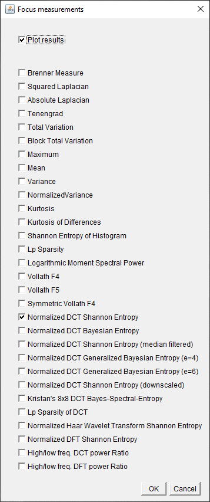
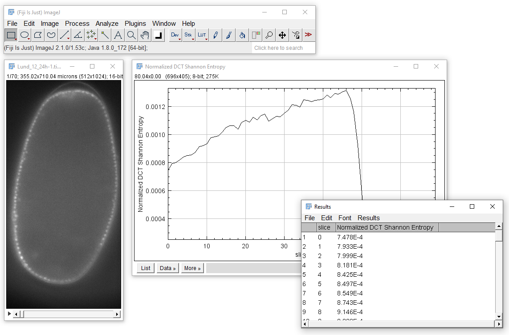

# AutoPilotImageQualityMetrics

This java repository contains an ImageJ/Fiji plugin allowing to measure image quality metrics published in 

Loic A. Royer, William C. Lemon, Raghav K. Chhetri, Yinan Wan, Michael Coleman, Eugene Myers and Philipp J. Keller.: Real-Time Adaptive Light-Sheet Microscopy Recovers High Resolution in Large Living Organisms. Nat Biotechnol. 2016

## Installation instructions
To use it, please download the two jar files from the [last release](https://github.com/SpimCat/imagequalitymetrics-microscopeautopilot/releases) and put them in the plugins directory of your Fiji installation.

## Usage
You find the plugins in the menu Plugins > SpimCat (on the very very bottom) > Quality Measurement. 
You can there choose to make measurements in tiles, regions or slice-by-slice on the whole image. These measurement from the publication above are available:

Depdending on if you activated to plot the measure(s), a plot window will open:

Otherwise, results are given in a table and/or an image with pixels representing measurments in tiles.

http://microscopeautopilot.github.io/

http://imagej.net/Fiji/Downloads
